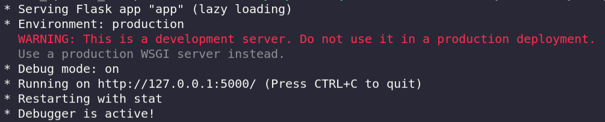

<p align="center">
  <a href="https://cdn.jim-nielsen.com/ios/512/opera-news-personalized-news-2019-07-23.png">
    
  </a>

  <h3 align="center">Novel Updates Scrapper</h3>

  <p align="center">
    A web app that lets you to get info on your favorite web novel from <a href="https://www.novelupdates.com" style="font">NovelUpdates</a>
    <br />
  </p>


## Table of Contents

- [Table of Contents](#table-of-contents)
- [About The Project](#about-the-project)
  - [Built With](#built-with)
- [Getting Started](#getting-started)
  - [Installation](#installation)


## About The Project


This a web app that lets you find the info about your favorite web novels from ). This web app takes in the name of the novel as the query parameter and scrapes data from the ) and provides it to the user.


### Built With
Here are major frameworks and tools used to build the web app.
* [Flask](https://flask.palletsprojects.com/en/1.1.x/)
* [BeautifulSoup](https://www.crummy.com/software/BeautifulSoup/bs4/doc/)

## Getting Started

These instructions will get you a copy of the project up and running on your local machine for development and testing purposes.


### Installation

What things you need to install the software and how to install them
```bash
# Clone this repository
$ git clone https://github.com/pseudo-ankit/Novel-Updates-Scrapper.git

# Go into the repository
$ cd Novel-Updates-Scrapper

# Install dependencies
$ pip install -r requirements.txt

# Running the web app
$ python app.py
```
After running the app.py script you should get below results.

Navigate to the url provided in the terminal and you should be able to access the web app.

After cloning the repo the file structure should be like below.
```bash
$ ls

Novel-Updates-Scrapper
│   README.md
│   requirements.txt
|   .gitignore
|   app.py
|   Procfile
|   scraper.py
│
└───templates
│   │   404.html
|   |   details.html
│   │   index.html
│   
└───static
    │   404.css
    |   details.css
    |   main.css
    │   app.py
    |
    |___images
        |
        |....
```


